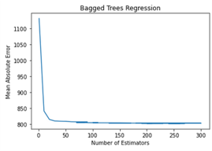
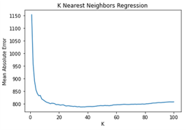
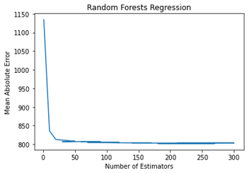
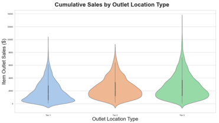
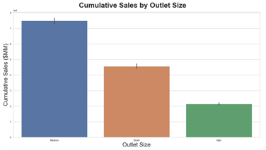
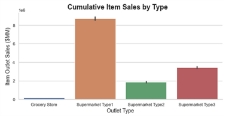
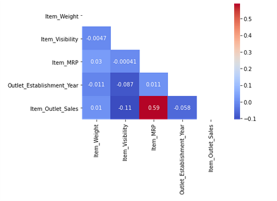

# Food Sales Predictions
> Sales predicitons for food items sold at various types of grocery stores

## Table of contents
* [General info](#general-info)
* [Screenshots](#screenshots)
* [Technologies](#technologies)
* [Setup](#setup)
* [Features](#features)
* [Status](#status)
* [Inspiration](#inspiration)
* [Contact](#contact)

## General info
The goal of this project is to help the retailer understand the properties of food products and grocery stores that affect food product sales.  With insight on which properties most affect sales at the retailer, decision makers can develop strategies for increasing sales.  Machine learning in python with sci-kit learn was used to make three models to predict sales and identify which product or retail outlet features were most crucial to sales volume.

## Screenshots

## Technologies
* Python 3.9.0 as development language
* Sci-Kit Learn 0.23.2 for modeling
* Models - K Nearest Neighbors Regressor, Bagged Trees Regressor, Random Forests Regressor

## Setup
Setup environment by importing pandas, numpy and the sci-kit learn models mentioned in the Technologies section

## Code Examples
See project1-partX notebooks

## Features
Regression Models predict item outlet sales with approximately $800 mean absolute error
* KNNR MAE: $787
* Bagged Trees MAE: $801
* Random Forests MAE: $802
Features that most affect Item Outlet Sales
* Item MRP
* Outlet Type
* Outlet Size 
* Outlet Location Type

To-do list:
* Make charts and graphics ready for print
* tune model hyperparameters if desired

## Status
Project is: _finished_, Moving onto the next project.

## Inspiration
As always, the good people in my coding community who provide guidance and wisdom as I take on more projects to develop my skillset.

## Contact
Created by Kenny Bundy - feel free to contact me!